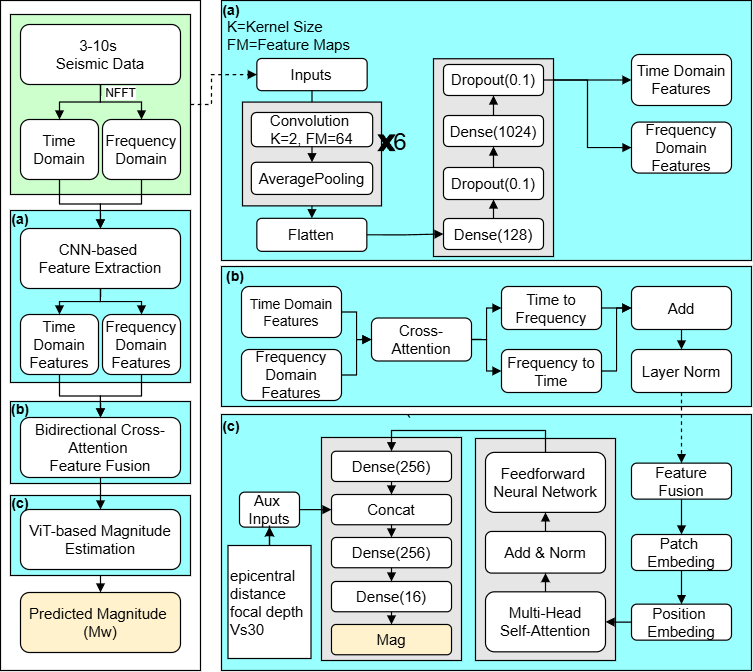
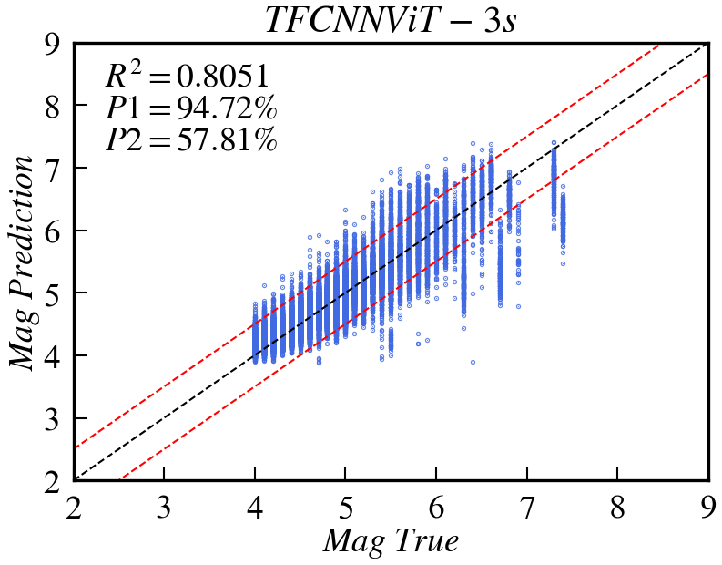
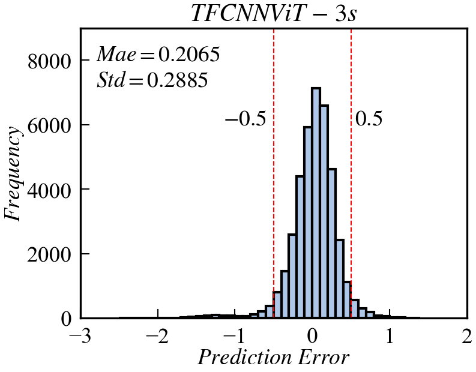

MoE-XGB Ground Motion Prediction Model
===

Repository Contents
---
Loading_TFCNNViT.py: Python script to load the pre-trained TFCNNViT model and make predictions.

TFCNNViT: Pre-trained model file.

requirements.txt: List of required Python dependencies.

Requirements
----
To run the model, install the required Python libraries:
The requirements.txt includes:
tensorflow-gpu==2.9.0
numpy==1.26.4
pandas==2.2.2
scikit-learn==1.5.2
keras==2.9.0

Input Parameters
-----
The model requires the following input features, in this exact order:

time-domain: 3–10 s vertical initial P-wave
frequency-domain: The vertical initial P-wave from 3 to 10 seconds is transformed into a power spectrum using NFFT.
EpiDist: Epicentral distance (km)
Depth: Hypocentral depth (km)
Vs30: Site condition (m/s)

Output
-----
Mag.: Magnitude (Mw)

Usage
-------
Download the model file:

Place TFCNNViT in a local directory.

Edit the calling script:

Open Loading_TFCNNViT.py in a text editor or IDE (e.g., PyCharm).

Modify the following sections:

data_path: Path to read Dataset.

model_path: Path to TFCNNViT.

save_path: Path to save predict result.

Model configuration:

Example Output
----

Notes
---
Ensure TFCNNViT is compatible with the tensorflow version specified in requirements.txt.

Contact
---
For questions or issues, please open an issue on the GitHub repository: https://github.com/lja666/EEWs/TFCNNViT.

